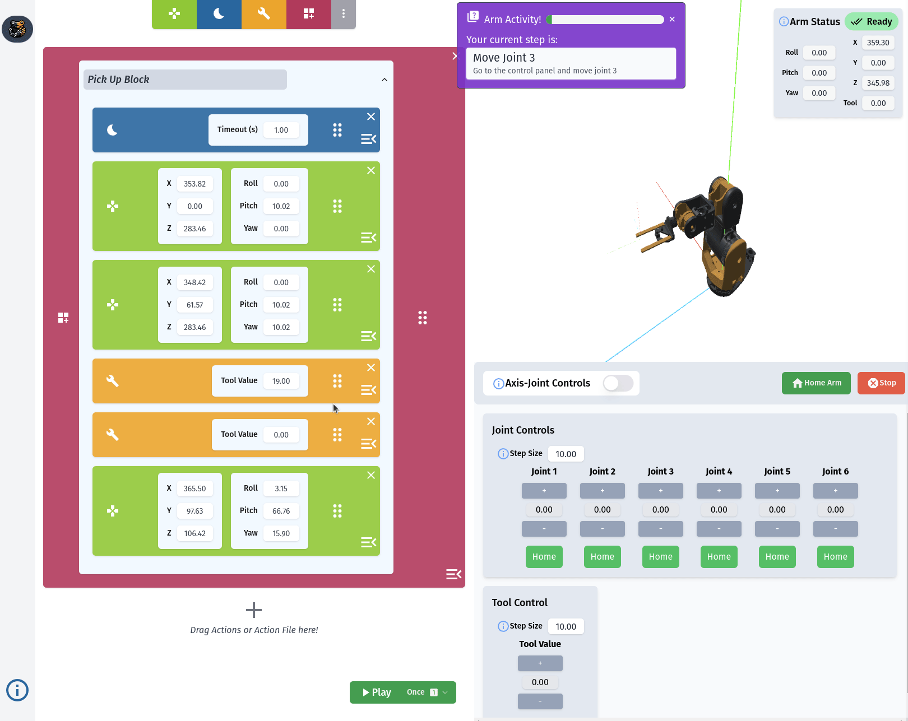

# Ribot: Robot Arm Controller

Welcome to the Ribot project, your comprehensive solution for controlling robotic arms with up to 6 degrees of freedom (DOF). This project encapsulates both firmware and software components tailored to deliver an exceptional user experience in robotic arm manipulation.



## Getting Started

### Prerequisites
- Docker Desktop: [Download here](https://www.docker.com/products/docker-desktop/)
- Python 3.8 or higher
- ESPTool Python package for firmware flashing (Required, if using Docker):
  ```bash
  pip install esptool
  ```
- Alternatively, you can use your own install of ESP IDF (v5.1.1) for manual firmware flashing.

### Installation

1. **Clone the Repository**
   ```bash
   git clone https://github.com/alberto-abarzua/ribot.git
   ```

2. **Manage.py Script**
   This utility script facilitates building, running, and managing the project.
   - Usage: 
     ```bash
     python manage.py --help
     ```

3. **Building the Firmware for ESP32**
   ```bash
   python manage.py build-esp
   ```

4. **Flashing the Firmware**
   ```bash
   python manage.py build-esp --flash
   ```

5. **Running Backend and Frontend Services**
   For real ESP32:
   ```bash
   python manage.py runserver --esp
   ```
   For a dummy firmware version (Docker):
   ```bash
   python manage.py runserver
   ```

## Project Components

### Firmware
- **Language**: C++
- **Framework**: ESP IDF
- **Target Platform**: ESP32 Microcontroller
- **Functionality**: Manages robotic arm control logic and real-time operations.

### Software
- **Backend**
  - **Language**: Python
  - **Framework**: FastAPI
  - **Functionality**: Facilitates communication between the frontend and firmware, processes control commands, and manages system state.
- **Frontend**
  - **Language**: JavaScript
  - **Framework**: React
  - **Functionality**: Provides a user interface for interacting with the robotic arm, sending commands, and receiving feedback.

## Communication
- Firmware to Backend: Sockets
- Frontend to Backend: WebSockets and HTTP requests

## Python Control Library for Ribot

The Ribot project utilizes a Python library, `ribot-controller`, to seamlessly integrate backend operations with the robot arm's firmware. This library is a pivotal component of the backend, enabling efficient and straightforward control of the robotic arm. It's available on PyPI and can be easily incorporated into Python-based applications.

### Key Features
- **Easy-to-Use Interface**: Provides simple and intuitive commands for robotic arm control.
- **Direct Connection with Firmware**: Ensures seamless communication between the backend and the robotic arm's firmware.
- **Python-based**: Leveraging Python's versatility and simplicity for robotic control tasks.

### Installation
To install `ribot-controller`, use pip:
```bash
pip install ribot-controller
```

### Example Usage
Below is an example illustrating how to use the `ribot-controller` library to control the robot arm:

```python
from ribot.control.arm_kinematics import ArmParameters, ArmPose
from ribot.controller import ArmController, Settings
from ribot.utils.prints import console

if __name__ == "__main__":
    console.log("Starting sample_main.py!", style="bold green")
    EPSILON = 0.01

    # Arm parameters (Physical dimensions of the arm)
    arm_params: ArmParameters = ArmParameters()
    arm_params.a2x = 0
    arm_params.a2z = 172.48

    arm_params.a3z = 173.5

    arm_params.a4z = 0
    arm_params.a4x = 126.2

    arm_params.a5x = 64.1
    arm_params.a6x = 169

    controller = ArmController(arm_parameters=arm_params)
    # The websocket server is used by the simulation in the Frontend
    controller.start(websocket_server=False, wait=True)

    controller.set_setting_joints(Settings.STEPS_PER_REV_MOTOR_AXIS, 400)
    controller.home()

    # Move to a position
    position = ArmPose(x=320, y=0, z=250, pitch=0, roll=0, yaw=0)
    controller.move_to(position)
    controller.wait_done_moving()

    # Move to angles (rads)
    angles = [0.0, 0.0, 0.0, 0.0, 0.0, 0.0]
    controller.move_joints_to(angles)

    # Move the tool (rads)
    controller.set_tool_value(1.2)

    print("Arm was homed?", controller.is_homed)
```

This example demonstrates initializing the controller, setting up the arm parameters, and executing various movements including positioning, angling, and tool manipulation.

### Documentation
For more detailed information and additional functionalities of the `ribot-controller` library.

Integrate `ribot-controller` into your project to experience the power and simplicity of controlling robotic arms with Python.

### Documentation
For detailed documentation, please visit our [Docs](https://ribot.dev).


### License
This project is licensed under the [MIT License](#).

---

Happy coding and controlling with Ribot! 🤖✨
